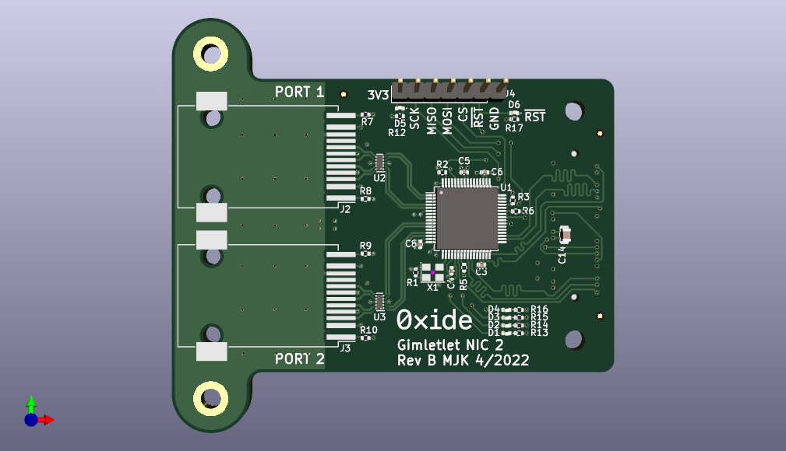

# hw-gimletlet-nic
Daughterboard for the Gimletlet 2 which uses a KSZ8463 to break out two ethernet (RJ-45) connectors. In active use for Hubris development.

Some [Design Notes](docs/DesignNotes.md)

# Status
In active use, no required rework.
